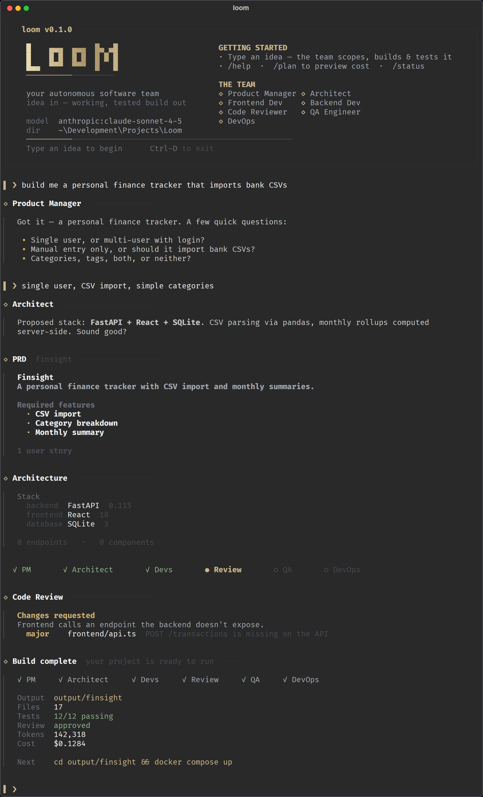
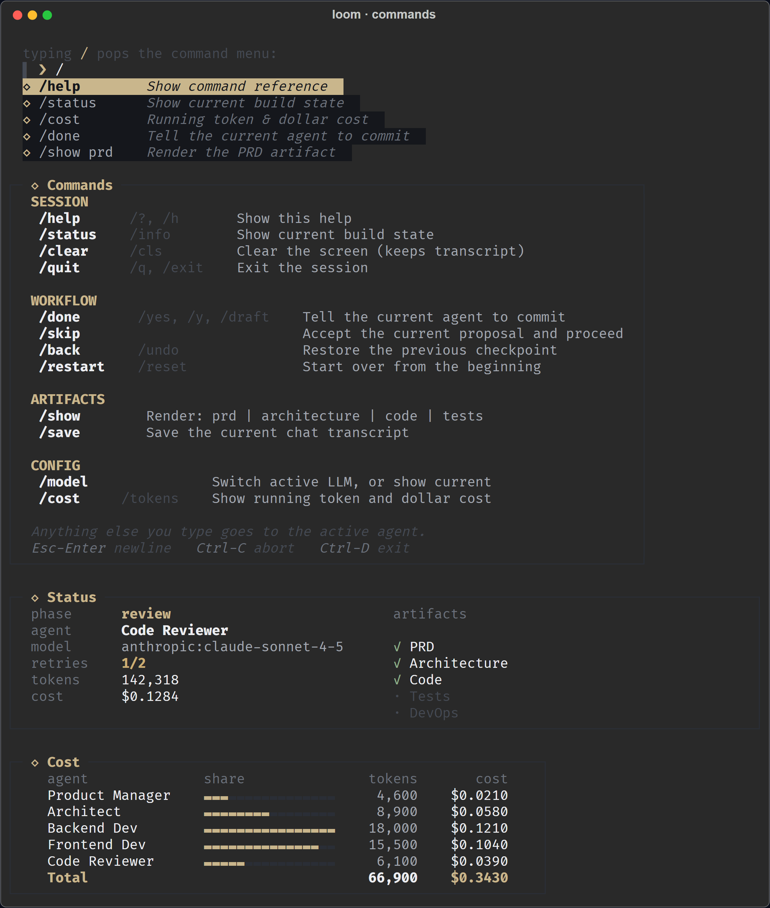
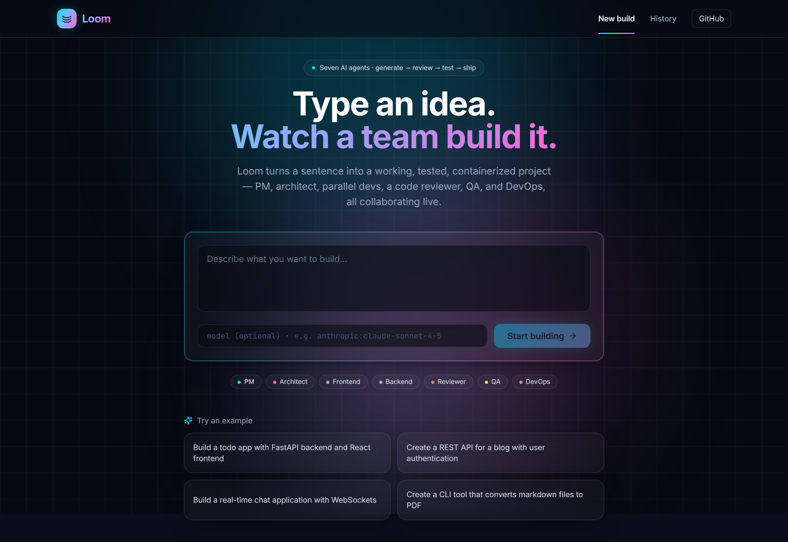
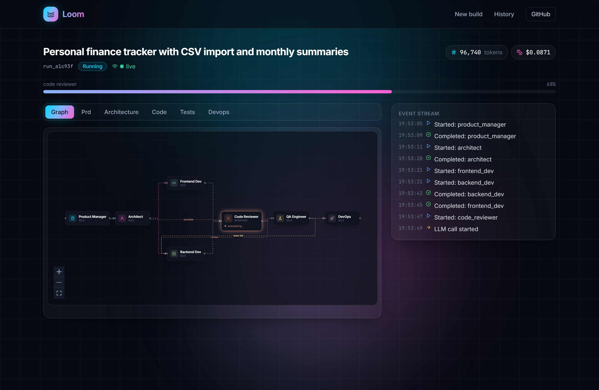
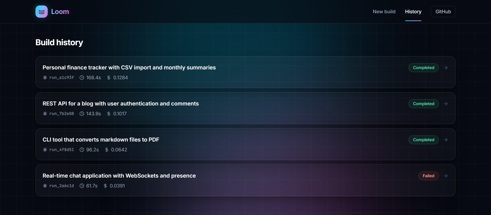

# Loom — Autonomous Software Development Team

> Type a project idea. Watch a team of AI agents collaborate — generate, **review each other's work**, and self-correct. Walk away with a working, tested, containerized MVP.

Loom is a multi-agent system built on **LangGraph** (orchestration / state machine) and **LangChain** (provider-agnostic LLM layer) that takes a natural-language project description and produces a complete codebase: PRD → architecture → parallel-built frontend + backend → **automated code review with a generator–critic loop** → tests run in a Docker sandbox → Dockerfile + CI/CD → architectural decision records.

Agents don't just run in sequence — the **Code Reviewer** critiques the generated code and dynamically hands work back to the developers (for code defects) or *upstream* to the architect (for design defects), using LangGraph `Command` handoffs, bounded so the loop always terminates.

The whole pipeline runs interactively as a **chat REPL** (the primary interface, like Claude Code) or non-interactively with a single command (for CI and scripting).

---

## Screenshots

### Chat REPL — the primary interface

A restrained, premium terminal: near-monochrome on charcoal with a single soft accent, quiet threaded message rails, and one subtle nod to the name — a woven "thread" hairline under the wordmark. The whole conversation — scoping, artifacts, the live pipeline, the reviewer's verdict, and the build summary — reads as one calm, cohesive transcript.

<p align="center">
  
</p>

Typing `/` pops a command menu, and `/help`, `/status`, and `/cost` render as clean panels (the cost view breaks spend down per agent as a quiet share bar):

<p align="center">
  
</p>

### Web dashboard (`loom ui`)

A real-time view of a build: the agent graph (with the Code Reviewer's `revise` / `escalate` feedback loops), live progress, cost, and artifacts.

<p align="center">
  <br><br>
  <br><br>
  
</p>

---

## Table of Contents

- [Screenshots](#screenshots)
- [What Loom Does](#what-loom-does)
- [The Agents](#the-agents)
- [Workflow](#workflow)
- [Quick Start](#quick-start)
- [Setup](#setup)
- [Usage](#usage)
- [The Chat REPL](#the-chat-repl)
- [Slash Commands](#slash-commands)
- [Output Layout](#output-layout)
- [Configuration](#configuration)
- [Architecture](#architecture)
- [Development](#development)
- [Testing](#testing)
- [Project Structure](#project-structure)
- [Status](#status)

---

## What Loom Does

```
You: "build me a CLI tool that converts markdown files to PDF"
                                  │
                                  ▼
   ┌──────────────────────────────────────────────────────┐
   │  📋 Product Manager  · multi-turn chat to scope       │
   │  🧠 Memory Retriever · context from past builds       │
   │  🏗  Architect       · proposes stack, you negotiate  │
   │  💻 Frontend Dev   ─┐                                 │
   │                     ├─ run in parallel via Send API   │
   │  ⚙  Backend Dev    ─┘                                 │
   │  🔍 Code Reviewer    · critiques code, then routes:   │
   │       ↳ defect → devs   ↳ design flaw → architect     │
   │       ↳ ok → QA      (generator–critic, bounded loop) │
   │  🧪 QA Engineer     · writes + runs tests in Docker   │
   │       ↓ (fail? feedback loop, max 2 retries)          │
   │  🚀 DevOps          · Dockerfile + docker-compose + CI│
   │  📝 ADR Generator   · architectural decision records  │
   │  💾 Memory Persister · saves build to vector store    │
   └──────────────────────────────────────────────────────┘
                                  │
                                  ▼
   ./output/markdown-to-pdf/
   ├── src/                  ← runnable code
   ├── tests/                ← passing tests
   ├── Dockerfile
   ├── docker-compose.yml
   ├── .github/workflows/    ← CI
   ├── docs/adrs/            ← decision records
   └── README.md             ← run instructions
```

You can `cd` into the output folder and `docker-compose up` to run the app immediately.

---

## The Agents

Each agent is a node in a stateful LangGraph state machine. They exchange typed Pydantic artifacts (PRDs, ArchitectureDocs, FileBundles, ReviewReports, TestReports), not free-form chat. Artifacts are produced with the model's **native structured-output mode** (tool/JSON calling) rather than parsing JSON out of free text — see [ADR 0001](docs/adrs/0001-native-structured-output.md).

| # | Agent | Role | Input | Output |
|---|---|---|---|---|
| 1 | **Product Manager** 📋 | Multi-turn conversational scoping | Description + your chat replies | `PRD` (user stories, features, data entities) |
| 2 | **Architect** 🏗 | Proposes stack & API design | PRD + memory context | `ArchitectureDoc` (stack, endpoints, components) |
| 3 | **Frontend Dev** 💻 | Generates UI code | PRD + Architecture | `FileBundle` of frontend files |
| 4 | **Backend Dev** ⚙ | Generates API + DB code | PRD + Architecture | `FileBundle` of backend files |
| 5 | **Code Reviewer** 🔍 | Critiques the build, then hands off | All code + PRD + Architecture | `ReviewReport` (approve / revise / escalate) |
| 6 | **QA Engineer** 🧪 | Writes & runs tests in Docker | All code | `TestReport` + retry feedback if any fail |
| 7 | **DevOps Engineer** 🚀 | Containerization + CI | All artifacts | Dockerfile, docker-compose.yml, GH Actions |

**Two more nodes** support the pipeline (not really "agents" but graph nodes):
- **Memory Retriever** 🧠 — vector-similarity search over past builds, injects context into the architect's prompt
- **Memory Persister** 💾 — stores the build artifacts back into the vector store on success

**Conversational vs. one-shot:** PM and Architect run in *conversational mode* during chat (multi-turn back-and-forth, then commit); the other five run in *one-shot mode* (single LLM call → artifact). When invoked via `loom build "..."` everything runs one-shot.

**The generator–critic loop:** after the developers produce code, the **Code Reviewer** judges it as a whole against the PRD and architecture and returns a `ReviewReport`. Based on its verdict it issues a LangGraph `Command` handoff — approve → QA, code defect → back to the targeted developer(s), or design defect → *upstream* to the Architect to revise the stack. The loop is bounded by `max_review_iterations` so it always terminates, and a reviewer failure degrades gracefully to QA. See [ADR 0002](docs/adrs/0002-code-reviewer-generator-critic-loop.md) and [ADR 0003](docs/adrs/0003-command-based-handoffs.md).

---

## Workflow

The pipeline is a [LangGraph state machine](https://langchain-ai.github.io/langgraph/) — a directed graph with conditional routing, parallel execution, and retry loops:

```
                    ┌──────────────────┐
   START ─────────▶ │ Product Manager  │ ◀──────┐
                    └─────────┬────────┘         │ self-loop
                              │                  │ (chat turns)
                              ▼                  │
                    ┌──────────────────┐         │
                    │ Memory Retriever │         │
                    └─────────┬────────┘         │
                              ▼                  │
                    ┌──────────────────┐         │
                    │    Architect     │ ────────┘
                    └─────────┬────────┘
                              │
                ┌─────────────┴─────────────┐   ▲          ▲
                │   parallel via Send API   │   │ escalate  │ revise
                ▼                           ▼   │ (design)  │ (code)
       ┌──────────────┐            ┌──────────────┐         │
       │ Frontend Dev │            │  Backend Dev │ ◀───────┤
       └───────┬──────┘            └──────┬───────┘         │
               └────────────┬─────────────┘                 │
                            ▼                                │
                    ┌──────────────┐   not approved?         │
                    │ Code Reviewer│ ────────────────────────┘
                    └──────┬───────┘   (Command handoff, max N)
                           │ approved
                           ▼
                    ┌──────────────┐
                    │ QA Engineer  │ ──────┐
                    └──────┬───────┘       │ tests fail?
                           │               │ feedback loop
                           │ pass          │ (max 2 retries)
                           ▼               │
                    ┌──────────────┐       │
                    │   DevOps     │ ◀─────┘
                    └──────┬───────┘
                           ▼
                    ┌──────────────┐
                    │ Memory Persist│
                    └──────┬───────┘
                           ▼
                          END
```

(The reviewer's "escalate" edge routes back up to the Architect, which then re-fans to the developers — omitted from the ASCII for clarity; see [ADR 0002](docs/adrs/0002-code-reviewer-generator-critic-loop.md).)

**Key LangGraph patterns used:**
- **Conditional edges** — routing decisions based on state (e.g., did tests pass?)
- **`Command` handoffs** — the Code Reviewer node returns `Command(goto=…, update=…)` to dynamically route to QA, a developer (`Send`), or the architect — the modern post-conditional-edge idiom
- **Send API** — Frontend & Backend devs run truly in parallel; also used to fan revisions back to specific devs
- **Generator–critic loop** — the reviewer critiques dev output and bounces it back, bounded by `max_review_iterations`
- **`interrupt_after`** — chat REPL pauses after each PM/Architect turn so you can talk
- **Checkpointing** — state persists between turns so you can resume sessions
- **Retry loops** — QA failure feeds error context back to devs, up to N attempts

---

## Quick Start

```bash
# Clone + install
git clone https://github.com/rihaans/CodeCrew.git loom
cd loom
pip install -e ".[dev]"

# Pick an LLM provider — one of:
ollama pull qwen2.5-coder:7b           # free local
export ANTHROPIC_API_KEY="sk-ant-..."  # Claude (recommended quality)
export OPENAI_API_KEY="sk-..."         # GPT-4o

# Verify everything's wired up
loom doctor

# Start the chat REPL
loom
```

Then type a project idea at the `You ▸` prompt and let the agents work.

---

## Setup

### 1. Python environment

Loom requires **Python 3.10+** (3.12 recommended). Install in editable mode with dev dependencies:

```bash
pip install -e ".[dev]"
```

For the memory system (vector retrieval over past builds), add the `memory` extra:

```bash
pip install -e ".[dev,memory]"
```

### 2. LLM provider — pick one

| Provider | Setup | Cost | Quality | Best for |
|---|---|---|---|---|
| **Ollama** (local) | `ollama pull qwen2.5-coder:7b` | Free | Good for code, weaker for chat | Hacking, offline, no API budget |
| **Anthropic Claude** | `export ANTHROPIC_API_KEY="sk-ant-..."` | ~$0.05–$0.30/build | Best | Production-quality results |
| **OpenAI** | `export OPENAI_API_KEY="sk-..."` | ~$0.05–$0.20/build | Very good | Familiar APIs |

**Recommended models per provider:**
- Ollama: `qwen2.5-coder:7b` (code) or `llama3.1:8b` (better chat)
- Anthropic: `claude-sonnet-4-5` (full quality) or `claude-haiku-3-5` (cheaper)
- OpenAI: `gpt-4o` (full quality) or `gpt-4o-mini` (cheaper)

### 3. Docker (for the QA sandbox)

QA tests run inside a Docker container for safety. If you don't have Docker, Loom falls back to a stub mode (tests pass automatically — useful for fast iteration but not real validation).

```bash
docker --version          # confirm Docker is installed
loom sandbox info          # check Loom's sandbox status
loom sandbox build         # build the Loom sandbox image (one-time, ~2 min)
```

### 4. Verify with `loom doctor`

```bash
loom doctor
```

Output should show green `[OK]` for:
- Python 3.10+
- At least one LLM provider configured (API key OR Ollama running)
- `prompt_toolkit`, `rich`, `aiosqlite` installed
- TTY detected
- Docker available + sandbox image built

Anything `[FAIL]` should be fixed before running a real build.

---

## Usage

### Chat REPL (recommended)

```bash
loom
```

You'll see a big LOOM banner and a `You ▸` prompt. Type your idea, then have a conversation with the PM:

```
You ▸ build me a personal finance tracker

📋  Product Manager
Got it — a few questions:
  • Single-user or multi-user (with login)?
  • Manual entry only, or should it import bank CSVs?
  • Categories, tags, both, or neither?

You ▸ single user, manual entry, simple categories

📋  Product Manager
Perfect — I have what I need. <READY_TO_DRAFT>

You ▸ yes
```

After "yes", PM drafts the PRD, the panel renders, and the Architect proposes a stack. Type "yes" again and the build pipeline runs autonomously.

### One-shot build (for CI / scripts)

```bash
loom build "A Flask API for expense tracking with monthly summaries"
```

No conversation — the PM and Architect produce their artifacts in a single LLM call each, and the build proceeds straight through.

### Plan-only (cost preview without spending tokens on code)

```bash
loom plan "your idea here"
```

Returns estimated cost, duration, file count, and a draft architecture — without running devs/QA/DevOps.

### Resume an interrupted session

```bash
loom history                 # list past chat sessions
loom history show <id>       # replay a transcript
loom resume <thread_id>      # resume from the last checkpoint
```

### Other commands

```bash
loom version              # show installed version
loom doctor               # diagnose setup
loom estimate "..."       # rough cost estimate
loom config show          # show resolved config
loom config init          # create loom.toml from template
loom sandbox info         # Docker sandbox status
loom sandbox build        # build the sandbox image
loom memory status        # vector store stats
loom memory list          # list past builds in memory
loom memory search "..."  # semantic search over past builds
loom ui                   # launch the web dashboard
```

---

## The Chat REPL

The chat REPL is what makes Loom feel like a teammate rather than a one-shot generator. Behind the scenes it:

1. Compiles the LangGraph state machine in **interactive mode** (`interrupt_after` PM and Architect)
2. Runs the graph until it pauses
3. Reads your input via `prompt_toolkit` (with arrow-key history, Ctrl-C to abort, Ctrl-D to exit)
4. Pushes your input into graph state via `update_state`
5. Resumes the graph until the next pause
6. Renders new agent messages with a **typewriter effect** and shows a **spinner** while the LLM is thinking

### Affirmative shortcuts

The PM has a turn cap (8 turns max) and uses a `<READY_TO_DRAFT>` sentinel to signal when it has enough info. To advance, you can:

- Type `/done`, `/yes`, `/y`, `/skip`, `/draft` (slash commands)
- Or just type plain `yes`, `ok`, `sure`, `done`, `go`, `looks good`, `lgtm`, `perfect`, `do it`, etc. — Loom detects these as draft triggers automatically

Long prose like *"yes but also add auth"* is **not** treated as affirmative — it's passed through as conversation.

### Visual experience

- **Big LOOM banner** at session start with a cyan→magenta gradient logo
- **Per-agent speaker bars** in their brand colors (📋 cyan, 🏗 magenta, 💻 blue, ⚙ green, 🧪 yellow, 🚀 violet)
- **Thinking spinner** between your input and the agent's reply: `⠋ PM is thinking…`
- **Typewriter rendering** of agent responses (~240 chars/sec)
- **Rounded panel artifacts** for PRDs and architecture summaries
- **Live progress** during parallel dev execution

For accessibility / CI:

```bash
loom --plain    # disable colors, animations, and rich rendering
```

---

## Slash Commands

While in a chat session, type any of these:

| Command | Aliases | What |
|---|---|---|
| `/help` | `/?`, `/h` | Show this list |
| `/done` | `/yes`, `/y`, `/draft` | Tell the current agent to commit (e.g. draft the PRD) |
| `/skip` | | Accept the current proposal as-is |
| `/quit` | `/q`, `/exit` | Exit the session (transcript saved) |
| `/restart` | `/reset` | Discard current build, start over |
| `/back` | `/undo` | Restore the previous checkpoint (one step back) |
| `/show <type>` | | Render an artifact: `prd`, `architecture`, `code`, `tests` |
| `/save [name]` | | Save the current chat transcript |
| `/model <id>` | | Show / switch active LLM |
| `/cost` | `/tokens` | Show running token + dollar cost |

Anything else you type is sent to the active agent as a message.

---

## Output Layout

A successful build produces a complete, runnable project under `./output/<project-slug>/`:

```
output/markdown-to-pdf/
├── src/
│   ├── main.py              ← entry point
│   ├── converter.py
│   └── styles/
├── tests/
│   ├── test_converter.py
│   └── test_cli.py
├── docs/
│   └── adrs/
│       ├── 0000-index.md
│       ├── 0001-python-cli.md
│       └── 0002-weasyprint.md
├── Dockerfile
├── docker-compose.yml
├── .github/
│   └── workflows/
│       └── ci.yml
├── requirements.txt
└── README.md                ← run instructions
```

To run the generated project:

```bash
cd output/markdown-to-pdf
docker-compose up
# or follow the generated README's instructions
```

---

## Configuration

Loom resolves configuration from (highest to lowest priority):

1. CLI flags (`--model`, `--no-memory`, etc.)
2. Environment variables (`ANTHROPIC_API_KEY`, `LOOM_*`)
3. `./loom.toml` (project-local)
4. `~/.loom/config.toml` (user-global)
5. Sensible defaults

Generate a starter config:

```bash
loom config init
```

A minimal `loom.toml`:

```toml
[llm.default]
provider = "anthropic"
model = "claude-sonnet-4-5"
temperature = 0.2
max_tokens = 4096

[build]
output_dir = "./output"
max_retries = 2
interactive = false

[sandbox]
use_docker = true
timeout_seconds = 90
memory_mb = 512

[chat]
no_streaming = false
plain = false
```

See [`loom.example.toml`](./loom.example.toml) for the full schema and per-agent overrides.

### Per-agent LLM overrides

You can pin specific agents to specific models — useful for cost optimization (cheap model for chat, expensive for drafting):

```toml
[llm.product_manager]
provider = "anthropic"
model = "claude-haiku-3-5"      # cheap for clarifying turns

[llm.backend_dev]
provider = "anthropic"
model = "claude-sonnet-4-5"     # quality for code generation

[llm.devops_engineer]
provider = "ollama"
model = "qwen2.5-coder:7b"      # mostly templated, free is fine
```

---

## Architecture

### Tech stack

- **Python 3.10+** — async-first
- **LangChain + LangGraph** — agent orchestration, state machine
- **Pydantic v2** — typed contracts between agents
- **Typer + Rich + prompt_toolkit** — CLI and chat REPL
- **FastAPI + React** — optional web dashboard (`loom ui`)
- **Docker** — code execution sandbox for QA tests
- **SQLite + LanceDB** — checkpointing and vector memory
- **pytest** — 475+ tests covering state, agents, graph, the review loop, and chat flow

### How agents talk

Agents don't free-form chat with each other. They exchange **typed Pydantic artifacts** through shared graph state:

```
PM             →  PRD                 →  Architect
Architect      →  ArchitectureDoc     →  Frontend + Backend Devs
Devs           →  FileBundle          →  Code Reviewer
Code Reviewer  →  ReviewReport        →  QA  ·  or back to Devs  ·  or up to Architect
QA             →  TestReport          →  DevOps (or back to Devs)
DevOps         →  DevOpsBundle        →  Memory Persist → END
```

Artifacts are produced via native structured output (`with_structured_output`), so the model is constrained to the schema rather than emitting JSON as free text. If a provider lacks structured output, Loom falls back to a text parser; on bad output the agent retries with the parse error fed back as feedback (up to 3 attempts per agent). See [ADR 0001](docs/adrs/0001-native-structured-output.md).

### State management

The graph schema is `LoomGraphState` — a TypedDict with `Annotated` reducers per field. Each field is its own LangGraph **channel**:

- `code_files` uses `merge_dicts` (frontend + backend writers can both contribute)
- `agent_messages` uses `merge_messages_dict` (per-agent chat history accumulates across turns)
- `events` and `costs` use `append_list` (audit trail)
- Most other fields use last-write-wins

This is what makes the chat REPL's per-turn state injection work cleanly — `update_state({"pending_user_input": ...})` only writes that one channel and leaves everything else alone.

### Memory system

Past builds are stored in a vector database (LanceDB or in-memory fallback). Before the Architect runs, the Memory Retriever does a semantic search and injects a "similar past builds" block into the prompt — so the Architect can learn from prior decisions.

```bash
loom memory list                # list stored builds
loom memory search "fastapi"    # semantic search
loom memory export memory.jsonl # export
loom memory import memory.jsonl # import
```

### Sandbox

QA tests run inside a Docker container with:
- 512 MB memory limit
- 90s timeout
- No network access
- Read-only mount of generated code

If Docker isn't available, Loom uses a stub sandbox that auto-passes — fine for development but not real validation. `loom sandbox build` constructs the Docker image (Python 3.12 + Node 20 + common test runners).

---

## Development

### Project structure

```
src/loom/
├── adr/              ← architectural decision records
├── agents/
│   ├── architect.py
│   ├── backend_dev.py
│   ├── frontend_dev.py
│   ├── product_manager.py    ← chat-mode + legacy paths
│   ├── reviewer.py           ← Code Reviewer (generator–critic, Command handoffs)
│   ├── qa_engineer.py
│   ├── devops_engineer.py
│   ├── memory_retrieve.py
│   ├── memory_persist.py
│   ├── base.py               ← build_agent_chain + structured-output binding
│   └── prompts/              ← all system prompts
├── cli/
│   ├── app.py                ← Typer CLI entry point
│   ├── chat/
│   │   ├── session.py        ← REPL loop driver
│   │   ├── renderer.py       ← rich-based output
│   │   ├── input.py          ← prompt_toolkit input
│   │   ├── commands.py       ← slash command parser
│   │   └── transcript.py     ← session persistence
│   └── tui.py                ← legacy Textual TUI
├── config/                   ← LoomConfig + per-agent LLM overrides
├── core.py                   ← public build/resume API
├── cost/                     ← cost estimation
├── graph/
│   ├── builder.py            ← StateGraph wiring
│   ├── routing.py            ← conditional edge functions
│   ├── parallel.py           ← Send API helpers
│   └── checkpoint.py         ← MemorySaver / SqliteSaver
├── llm/                      ← provider-agnostic LLM layer
├── memory/                   ← vector store + retrieval
├── observability/            ← logging, tracing, metrics
├── output/                   ← writes generated projects to disk
├── plan/                     ← cost preview without code generation
├── sandbox/                  ← Docker test runner
├── server/                   ← FastAPI dashboard backend
└── state/
    ├── enums.py              ← Phase, AgentRole, EventType, etc.
    ├── models.py             ← AgentState, PRD, ArchitectureDoc, etc.
    └── reducers.py           ← merge_dicts, merge_messages_dict, etc.

tests/
├── unit/                     ← agent + state + graph unit tests
└── integration/              ← end-to-end pipeline tests

docker/sandbox.Dockerfile     ← QA sandbox image
docs/adrs/                    ← architecture decision records
loom.example.toml             ← config template
pyproject.toml                ← deps + entry points + tooling
```

### Running locally

```bash
# Install in editable mode
pip install -e ".[dev]"

# Format + lint
ruff check src tests
ruff format src tests

# Type check
mypy src/loom

# Run a build
loom build "todo app"
```

### Adding a new agent

1. Create the prompt in `src/loom/agents/prompts/<agent>.py`
2. Implement the node function in `src/loom/agents/<agent>.py` (async, returns a state-update dict)
3. Wire it into the graph in `src/loom/graph/builder.py`
4. Add routing logic to `src/loom/graph/routing.py` if conditional
5. Write unit tests under `tests/unit/test_<agent>.py`
6. Record any architecturally significant decision as a new ADR in `docs/adrs/`

### Debug mode

```bash
LOOM_CHAT_DEBUG=1 loom
```

Prints `[debug] next=... agent_status=... interactive=... prd=... error=...` before each loop iteration so you can see graph state transitions in real time.

---

## Testing

```bash
# Run everything (unit + integration)
pytest

# Just unit tests (fast)
pytest tests/unit

# Specific module
pytest tests/unit/test_conversational_pm.py -v

# With coverage
pytest --cov=src/loom --cov-report=html
```

**Test coverage:**
- Pydantic models + reducers (state machine correctness)
- Each agent node (mocked LLMs), including the Code Reviewer's verdict handoffs
- Graph builder + conditional routing
- The generator–critic review loop end-to-end through the compiled graph (revise + escalate paths terminate)
- Structured-output binding + parser fallback
- Chat REPL: slash command parser, renderer snapshots, session state machine, full conversation flow
- LLM cost estimation
- Memory store + factory
- Plan / ADR generation
- Output writer

The test suite uses **mocked LLMs** for unit tests and **fully scripted** end-to-end tests in `tests/integration/test_chat_full_flow.py`. Real LLM validation is manual (run `loom build "..."` against Ollama or Claude).

### Current state

- **475 tests passing**
- 0 regressions on the legacy `loom build` path
- Real-LLM e2e validation: manual

---

## Project Structure

```
loom/
├── README.md                ← you are here
├── pyproject.toml           ← Python package config
├── loom.example.toml        ← config template
├── src/loom/                ← implementation (see Development for the full tree)
├── tests/                   ← unit + integration test suite
├── frontend/                ← web dashboard (React + Vite + Tailwind)
├── docker/sandbox.Dockerfile← QA sandbox image
├── docs/
│   ├── adrs/                ← architecture decision records
│   └── screenshots/         ← README imagery
└── output/                  ← generated projects land here (gitignored)
```

---

## Status

**Phases 0–9 complete.** The chat REPL works end-to-end through PM → Architect → parallel dev → **Code Reviewer** → QA → DevOps. 475 tests pass. Build outputs are runnable.

**What's working:**
- ✅ Multi-turn conversational PM and Architect
- ✅ Parallel frontend + backend code generation
- ✅ **Code Reviewer agent — generator–critic loop with `Command` handoffs (revise → devs, escalate → architect), bounded**
- ✅ **Native structured output (`with_structured_output`) with a text-parser fallback**
- ✅ Docker sandbox QA with retry feedback
- ✅ Containerization (Dockerfile + docker-compose + GH Actions)
- ✅ ADR generation
- ✅ Vector-memory retrieval
- ✅ Cost estimation + planning
- ✅ Chat REPL with typewriter + spinner UX
- ✅ Transcript persistence + replay
- ✅ Provider-agnostic LLM layer (Anthropic / OpenAI / Ollama)
- ✅ 475 tests, zero regressions on legacy path

**Known limitations:**
- Conversational quality with `qwen2.5-coder:7b` is rough (the model is code-tuned, not chat-tuned). Use `llama3.1:8b` or Claude/GPT for smoother chat.
- The chat REPL animates each agent reply with a typewriter effect over the *completed* response, not live per-token streaming. Real token streaming is intentionally deferred for the conversational agents because the PM's reply protocol wraps text in JSON (`{"message": …}`) that is unwrapped after the call — streaming raw tokens would surface the JSON. The streaming infrastructure (`astream_events` → typed events) exists in `observability/` for the non-interactive build path.
- The web dashboard (`loom ui`) is functional but not fully polished.

**Roadmap:**
- Stream the Architect's (plain-text) turns live, and migrate the PM reply protocol off JSON-wrapping so it can stream too
- File-write confirmation gate before `output/` materialization
- Better error panels for Docker / Ollama / API failures
- 90-second demo screencap

See the [architecture decision records](docs/adrs/) for the reasoning behind the key design choices.

---

## License

MIT
